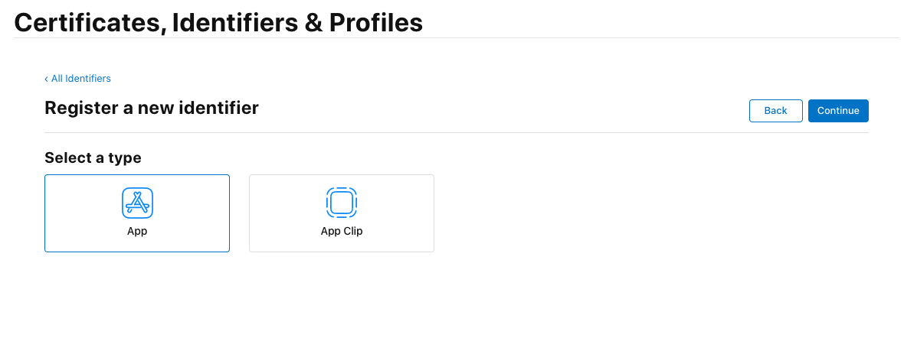
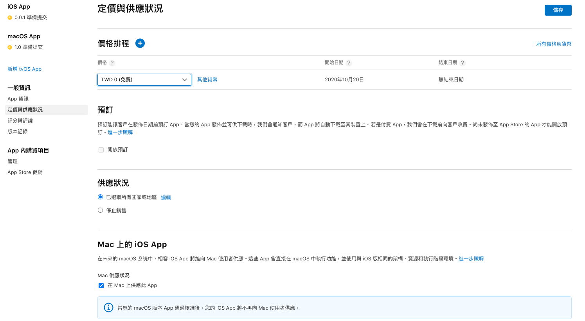
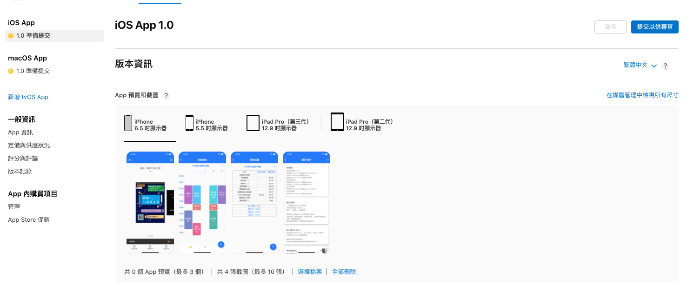
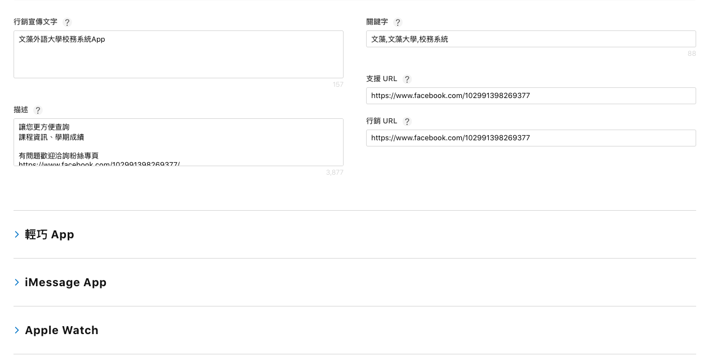
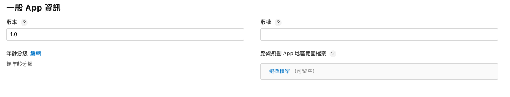
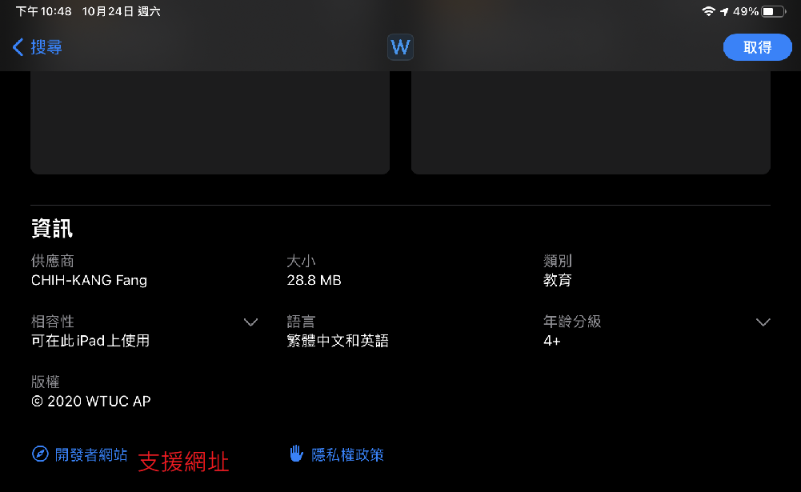
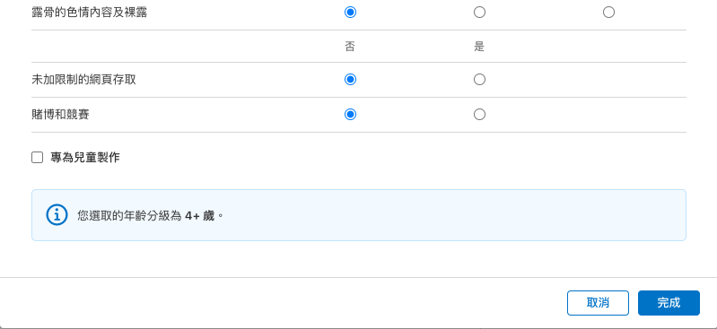
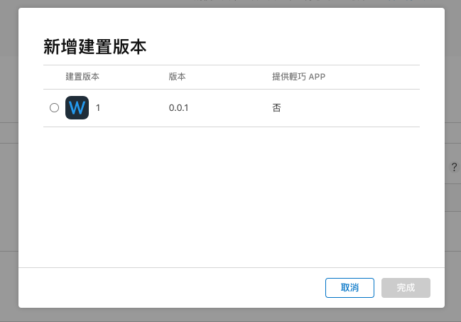
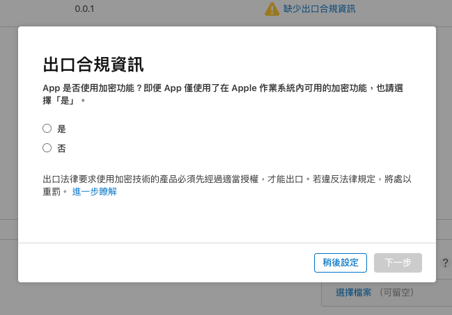

# 新增 App

到 [App Store Connect](https://appstoreconnect.apple.com/) 點擊 `我的App`

點擊 App 旁邊邊的 + 選擇 `新的 App`

# 註冊Identifier

到 [憑證、識別碼及描述檔](https://developer.apple.com/account/resources/identifiers/list) 註冊App的 `Identifier`

選擇 `App IDs`

選擇 `App`

**Discription** 填寫可以識別的名稱

**App ID Prefix** 選擇 `Explicit` 並填上與 Xcode 中的 `Bundle Indentifier` 相同的 ID

**App ID Prefix 的 Bundle ID 上架後就不可修改**

最後點擊 `Continue` 然後 `Register` 完成註冊

或是

懶人方法

使用 `Xcode` 在 `Target` 中的 `Runner` 選擇 `Signing & Capabilities`

選擇想要上架的Apple開發者帳號

並點擊 `+ Capability` 隨意新增一個 Capability

此動作 `Xcode` 會自動註冊 `Indentifier` 至 App Store Connect

完成後再將其取消 

沒取消的話審查時會納入審查範圍 要特別注意

接著填寫App基本資訊

 - 平台：選擇你的App會在哪些平台提供，若沒勾選可事後新增
 - 名稱：在Apple Store的名稱，無法跟已上架App相同，命名上需要先搶先贏，除非對方把App刪除或修改名稱，也是使用者搜尋時能找到你的App的首要途徑
 - 主要語言：首先可在商店提供的語言，若有發佈不同國家語系，可事後新增
 - 套件識別碼：選擇剛才新增的 `Indentifier`，選擇後就不能修改，對應到原生的 `Bundle Indentifier`
 - SKU：App ID 為獨一無二，可任意命名，填寫後不能修改，但不會公開顯示

# App 資訊

新增 App 後，可先來 一般資訊 -> App 資訊，填寫 App 基本資訊，這邊會分兩個區塊，一個是可本地化資訊及一般資訊

### 可本地化資訊

 - 名稱：必填，為一開始輸入的 App 名稱
 - 副標題：必填，商店中會位於 App 名稱下方，建議使用簡短語句說明 App
 - 隱私權政策：必填，聲明你的 App 隱私權政策的網址，不限制格式

### 一般資訊

 - Apple ID：由 Apple 產生，作為網頁上的編號，可至 https://apps.apple.com/tw/app/id`${你的 Apple ID}`，找到你的App
 - 內容版權：聲明你的 App 是否有第三方內容，像是以校務通來說，資料來源於學校，就可以視為第三方內容 
 - 年齡分級：必填，根據填寫 [年齡分級問卷](#/年齡分級問卷) 的結果
 - 許可協議：必填，預設使用 [《Apple 標準終端使用者許可協議》(EULA)](https://www.apple.com/legal/internet-services/itunes/dev/stdeula/)，可點擊自訂許可協議
 - 類別：必填，在商店的分類，可選擇兩個，也作為與同類型App排名的分類

# 定價與供應狀況

 - 價格排程：選擇你的App定價方式，最低免費到最高 32900元，使用者付費購買後90天內都可以反悔
 - 預定：第一次上架前會顯示，自訂日期在App成功發布後，會通知預定的使用者
 - 供應狀況：需先填寫`供應國家與地區`，若選擇停止供應，會從商店下架，直到重新供應為止
 - Mac 上的 iOS App：如果你的iOS App有使用到 [Mac Catalyst
](https://developer.apple.com/mac-catalyst/)(Flutter 目前不支援)，會將你的iOS App發佈至 Mac App Store，若有發佈macOS App，則優先發布 macOS App
 - App發布方式：根據你的開發者帳號，若個人開發者帳號只能選擇公開在Apple Store，若是企業開發者帳號，則可以發布到私人的商店發布

# App版本資訊

進入 App `版本資訊` 後

首先設定 `App預覽與截圖` 可參考以下規格 **`每個至少三張`**

12.9 吋 iPad Pro 第三代 及 第二代 尺寸是可以相容的 故截圖第三代 可直接上傳到第二代

建議使用模擬器截圖 上傳完可用滑鼠拖曳改變顯示順序

|        螢幕尺寸說明        |                           平台                          |                      截圖尺寸                     |
|:--------------------------:|:-------------------------------------------------------:|:-------------------------------------------------:|
|        iPhone 6.5 吋       | iPhone 11 Pro Max、iPhone 11、iPhone X S Max、iPhone XR | 1242 x 2688 像素（直向） 2688 x 1242 像素（橫向） |
|        iPhone 5.5 吋       |       iPhone 8 Plus、iPhone 7 Plus、iPhone 6s Plus      | 1242 x 2208 像素（直向） 2208 x 1242 像素（橫向） |
| 12.9 吋 iPad Pro（第三代） |               iPad Pro 2018、iPad Pro 2020              | 2048 x 2732 像素（直向） 2732 x 2048 像素（橫向） |
| 12.9 吋 iPad Pro（第二代） |                      iPad Pro 2017                      | 2048 x 2732 像素（直向） 2732 x 2048 像素（橫向） |

更多詳細資訊 [可參考](https://help.apple.com/app-store-connect/#/devd274dd925)

接著填寫

 - 行銷宣傳文字：作為 App 行銷宣傳標語，建議簡短的文字，也要符合App的性質
 - 關鍵字：在商店搜尋時，透過關鍵字加強找到App，並使用逗點隔開
 - 描述：詳細介紹App的功能與特色
 - 支援URL：對應商店開發者網頁
 - 行銷URL：待補充
 - 版本：可參考 [語意化版本](https://semver.org/lang/zh-TW/)，不限定兩碼或三碼，不能與先前定義的相同
 - 版權：宣告App版權的註解
 - 年齡分級：根據填寫 [年齡分級問卷](#/年齡分級問卷) 的結果（需點擊編輯填寫）

對應在商店的位置可參考

## 年齡分級問卷 

針對App的內容填寫是否有兒童不宜的

## App審查資訊

蘋果在審查時都是採用 `人工審查`，審查過程都須填寫完整的資料

- 登入資訊：若你的App有設計登入功能，需提供測試帳號給審查人員
- 聯絡人資訊：當審查有問題時的聯絡人資訊，電話號碼需要加入國際冠碼
- 備註：資訊則提供其他資訊供審查人員了解你的App，像是之前就被問過這幾個問題，爾後我都在新的App加入這些回答
    - Who is the target audience?
    - How do users obtain an account?
    - Is this app meant for internal distribution in your own company, in the company of one target client, or in multiple target clients’ companies?
    - In which countries will this app primarily be distributed?
    - If this app is meant for internal distribution, will the app be accessible by both internal and external partners? Or will it be exclusive to in-house employees?
 - 附件：可附上App操作影片，若你的App無法提供帳號測試，或是有些功能需要提供範例影片操作(ex.何時會使用到讀取wifi連線資訊的功能)，都需要附上影片

### 建制版本

接著選擇要送至審查的App版本，需先透過Xcode `Archive` 後上傳至App Store Connect，點擊藍色按鈕

選擇對應想提交的版本，通常上傳完會需要一段時間處理，當完成處理都會email通知

屆時才會出現在這邊

接著選擇這次提交的出口合規資訊，點擊是否有使用加密功能，若點擊是的話，需要另外填寫出口法律資訊

### 廣告識別碼

最後是填寫是否有使用到 `廣告識別碼`，像是 Firebase Analytics 或是 Ad Mod 等第三方的廣告或分析工具，就需要聲明有使用到，若審查後發現錯誤，則需要重新上傳新的App版本

**最後回到最上方點擊完成，並點擊審查，結著就會進入正在等待審查**

通常審查時間已台灣都是晚上開始到半夜，對應到美國的白天時間，第一次審查都會比較久，大約2~3天，要耐心等待

但有時候會審查失敗，也會寄送 email 通知，可至連結查詢問題，並回覆審查人員

iOS Resolve Center : [https://appstoreconnect.apple.com/apps/`{apple id}`/appstore/platform/ios/resolutioncenter?m=]()

macOS Resolve Center : [https://appstoreconnect.apple.com/apps/`{apple id}`/appstore/platform/osx/resolutioncenter?m=]()

若審查成功，則會通知 `Ready for Sale`，完成這次版本審查

