# 大綱
* 題目：Voronoi Diagram Term Project
* 系級：資工碩一
* 姓名：房志剛
* 學號：M073040003
# 軟體規格書
## 輸入測資
輸入檔案格式可接受 ".txt檔"  
可接受**有註解**及**無註解**檔案  
其中有註解版本 即為在每行前面加入「＃」代表該行為註解 不須理會  
每筆測資第一個變數N代表該筆測資會有N個點  
接著讀入N行 x y 的點資料對  
重複直到當N等於0 則結束測資
## 輸出測資
輸出檔案格式為 ".txt檔" 檔名 "out.txt"
紀錄執行完的結果 分成兩個部分
* 所有點的資料 按照 lexical order 排序  
格式為 "P x y"  
其中x及y代表座標位置
* 所有voronoi-diagram線段的資料 按照 lexical order 排序  
格式為 "E x1 y1 x2 y2"  
其中x及y代表座標位置 後標為點1和點2組成的線段  
# 功能規格與介面規格
* 畫布：  
若無載入測試資料 則為手動模式   
並可直接在畫布上點擊 並顯示點及座標
* 開啟檔案：選擇輸入測資檔案並將點測資載入至畫面
* 下一筆：當開啟測試資料後 進入讀取模式 點選可顯示下一筆測試資料 直到最後一筆測資
* 輸出檔案：將目前畫布上的結果輸出成 out.txt 並選擇目標資料夾
* 執行：將畫布上的點直接顯示 Voronoi Diagram 結果
* Step by Step：若無點選執行 則以 divide-and-conquer   
    單步執行 Voronoi Diagram 每次停止在merged前 並以不同顏色顯示 資料  
    * 紫色點和線段 代表 左半邊Voronoi Diagram的點和線段
    * 淺綠色點和線段 代表 右半邊Voronoi Diagram的點和線段
    * 橘色線段代表 Hyperplane
    * 紅色的點代表 已處理或處理完畢的點
    * 黑色的線段代表 已處理或處理完畢的線段
    * 綠色的線段代表 ConvexHull
* Convex Hull：  
在尚未執行Voronoi Diagram 點   
顯示畫布上所有點的Convex Hull 再次點擊可隱藏
* 清空畫布：清空所有資料 包括點和線 及 測試資料
* 選取輸出檔：跳出檔案選取器 選擇輸出檔案資料 並輸出至畫布
* InputData：顯示目前點選的 點資料 或 測試資料點
* OutputData：執行Voronoi Diagram的線段資料

## 軟體測試規劃書
程式碼可從 GitHub 下載下來 可選擇直接編譯  
或者 使用附錄中的jar檔  
按照功能書執行下列功能
# 軟體說明
## 軟體安裝
可從 GitHub 將專案 clone 下來  
位址：**https://github.com/abc873693/voronoi-diagram**  
切換至分支**master** 並tag為 **final-version**  
使用**IntelliJ IDEA** 此IDE並在 PC 安裝 JDK   
並選取main.kt 找到fun main() 並編譯即可執行
畫布大小為：600 * 600
## 使用步驟
安裝完畢執行主程式
### 使用檔案測資
1. 點選"**開啟檔案**"選取輸入測資檔案 並按下確定
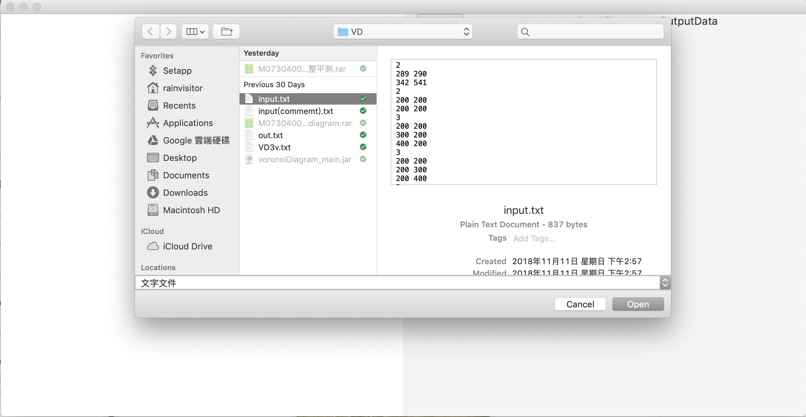
1. 顯示檔案中的第一筆測資至畫布上
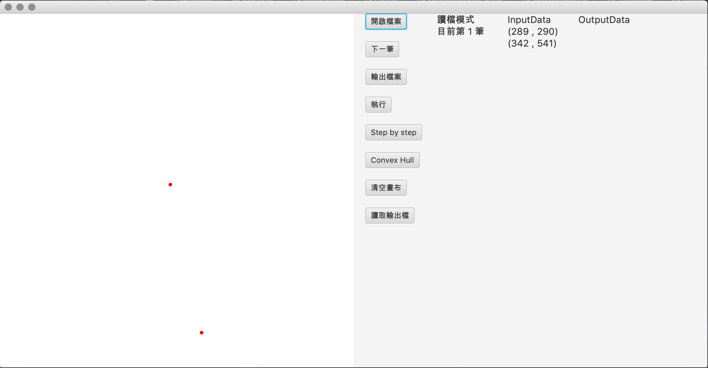
1. 可點選"**Convex Hull**" 直接顯示畫布上所有點的 Convex Hull 再次點擊可隱藏(限定無執行 Voronoi Diagram)
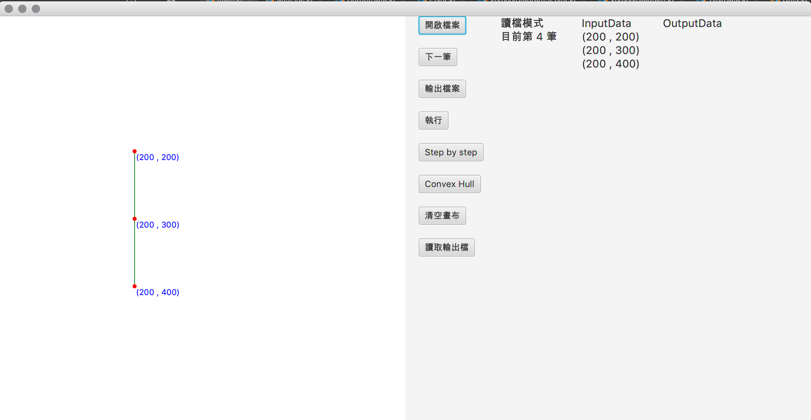
1. 可點選"**執行**" 直接顯示 Voronoi Diagram 的結果
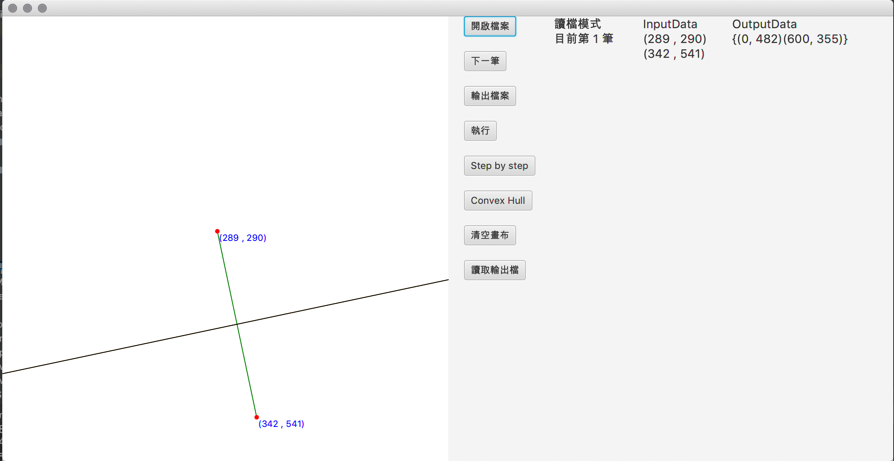
1. 可點選"**Step by Step**" 以 divide-and-conquer 逐步執行 Voronoi Diagram 的過程 並最後顯示結果
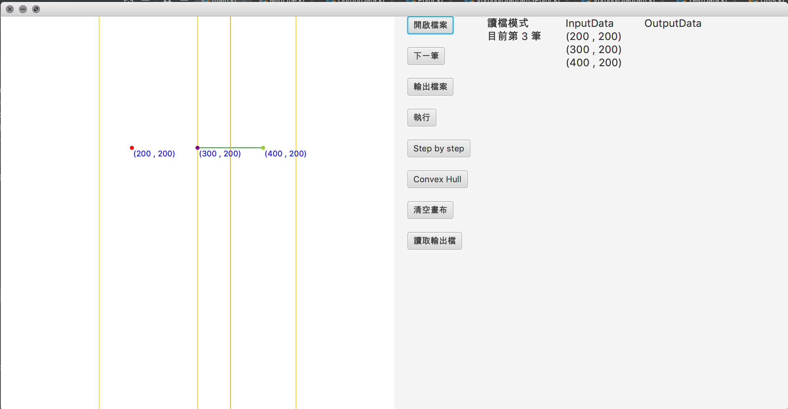
1. 點選"**下一筆**" 會清空畫布上的資料 並顯示下一筆測資
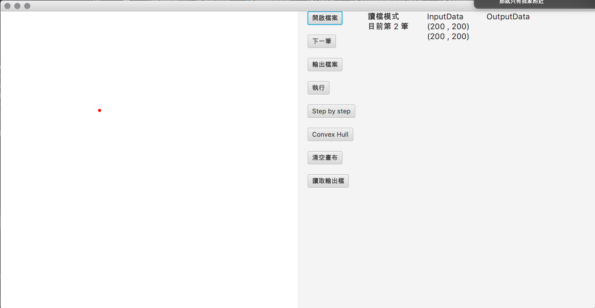
1. 點選"**清空畫布**" 會清空畫布 並重置檔案測資狀態
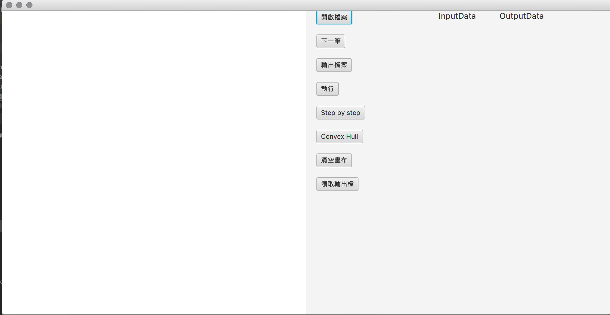
### 直接點擊畫布 
1. 直接點擊畫布 顯示點選的 點及座標
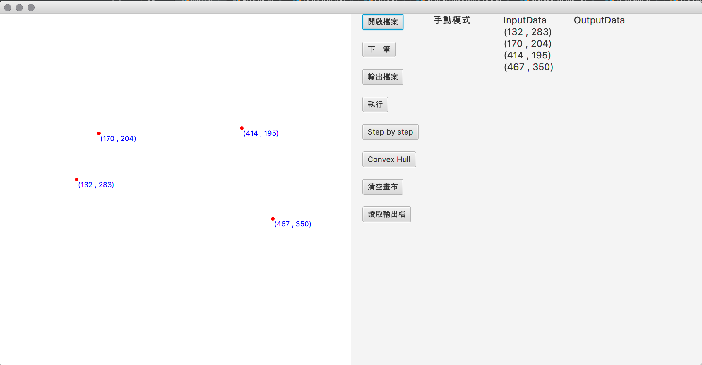
1. 可點選"**Convex Hull**" 直接顯示畫布上所有點的 Convex Hull 再次點擊可隱藏(限定無執行 Voronoi Diagram)
1. 可點選"**執行**" 直接顯示 Voronoi Diagram 的結果
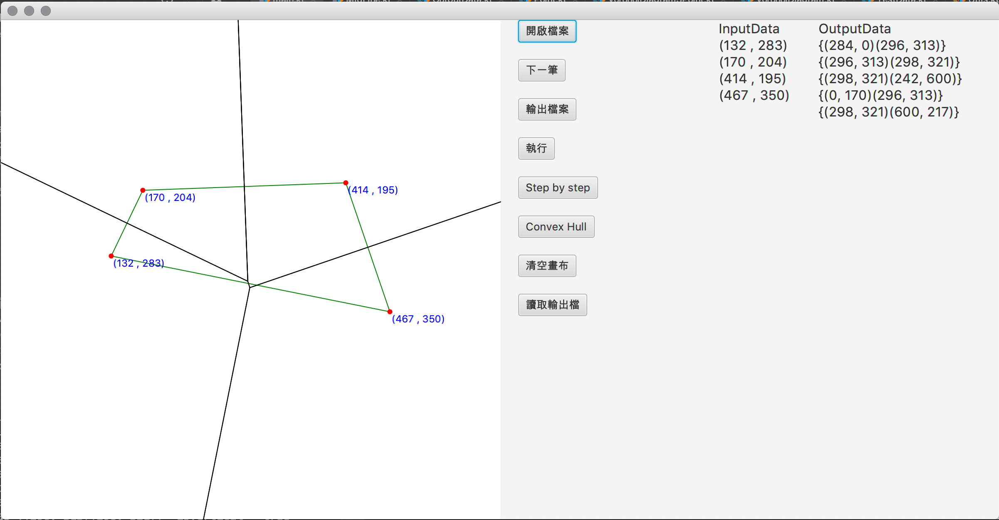
1. 可點選"**Step by Step**" 以 divide-and-conquer 逐步執行 Voronoi Diagram 的過程 並最後顯示結果
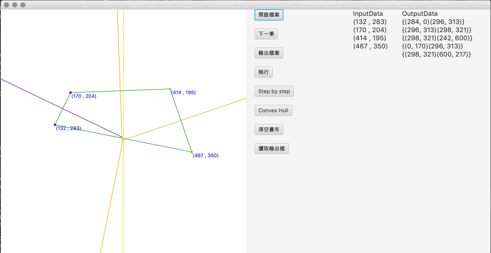
1. 點選"**下一筆**" 會清空畫布上的資料 並顯示下一筆測資
1. 點選"**清空畫布**" 會清空畫布 並重置檔案測資狀態
## 程式設計：
使用divide-and-conquer來實作
### Divide
先以點以 lexical order 將點排序  
再來以 x軸 將點座標平分到最細  
以兩兩為單位開始實作conquer
### Convex Hull
先以點以 lexical order 將點排序 先選取平面上最左邊的點  
在選取兩點判斷角度是否為鈍角 若為鈍角則為Convex Hull的點  
在選取其中兩點繼續找下一個點找為鈍角 直到沒有其他點  
最後點的順序則為 Convex Hull
### Conquer
以divide將點分開之後 接著按照x軸大小  
區間順序為[1, 2, 4, 9, 18, 37, 75, 150, 300, 600]合併直到大小為600(畫布大小)  
每次合併時 先找出兩邊的 Convex Hull 及合併後的點 的 Convex Hull  
找出合併後 不存在Convex Hull的點 又因不存在的點一定為找出 合併後的**Hyperplane**  
其中不存在的點前後兩點 左半邊及右半邊 組合起來為上切線 及 下切線  
從上切線開始兩兩點先找出中垂線 再看兩邊的下一個點哪個比較高 則為下一個垂直平分線  
接著在將比較高的與倆倆的垂直平分線與原本中垂線交點 取比較高的為交點  
將垂直平分線 按照較高的點的位置 截半同時將 同邊的一樣擷半   
存至下一次垂直平分線的開頭 重複執行 至下切線 結束合併
但各只有一點時時直接判斷為垂直平分線
最後則找出 Voronoi Diagram
## 軟體測試與實驗結果：
* 使用語言：Kotlin(JVM)
* 編譯器：IntelliJ IDEA 2018.3 (Community Edition) Build #IC-183.4284.148, built on November 21, 2018
* JRE: 1.8.0_152-release-1343-b15 x86_64
* JVM: OpenJDK 64-Bit Server VM by JetBrains s.r.o
* 作業系統：macOS 10.14.1
* CPU：Intel Core i5 2.3 GHz 
* 記憶體：16 GB 2133 MHz LPDDR3
* 顯示卡：Intel Iris Plus Graphics 655 1536 MB
## 實驗結果
可顯示部分三點及四點的情況
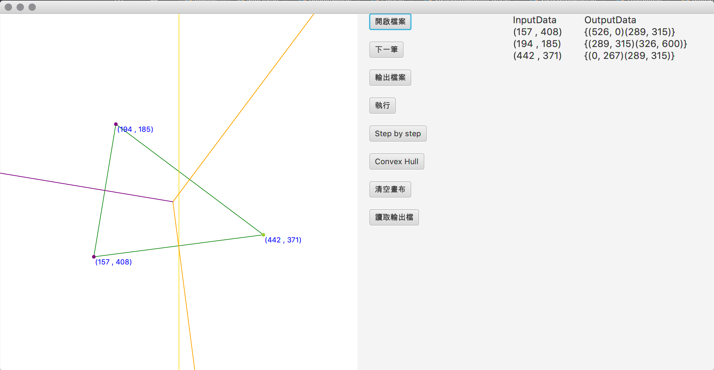

部分的線段可能會截錯邊   
或是超出畫布 導致顯示困難

可能是在判斷斜率上 沒有說很謹慎  
需在偵錯 才能有比較好得結果
# 結論與心得
選擇語言時猶豫許久 因為個人嗜好 最近比較常寫 Kotlin   
又因當初著網站有說明 任何語言可以  
只要能執行在Windows作業系統上 理論上都沒問題  
最後也感謝助教與老師同意使用  
過程也思考如何執行divide-and-conquer  
但結果能有改進空間 過程也與同學討論不少  
希望未來能在這個思考上更有進步  
能應用在未來的實作上  
幫助自己撰寫程式的能力提升  